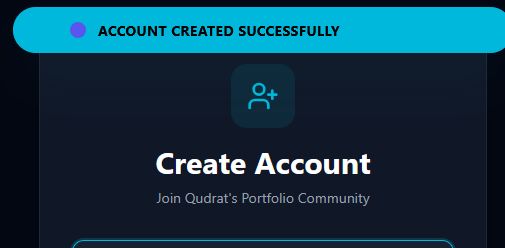
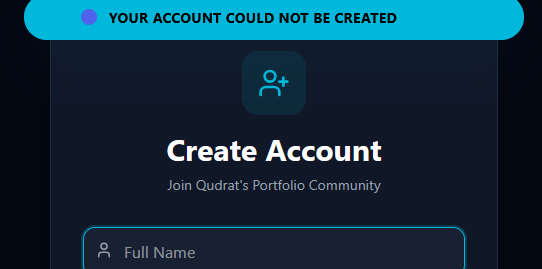
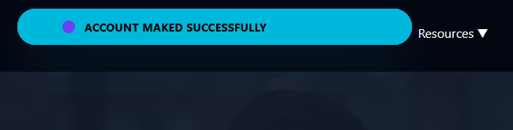
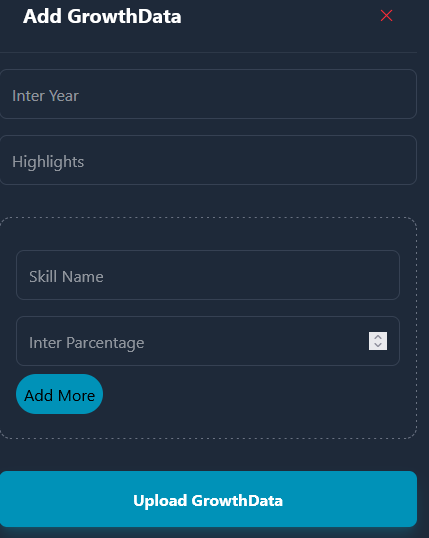
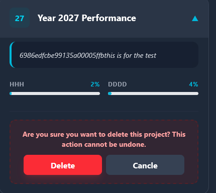
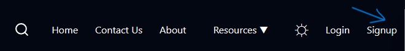
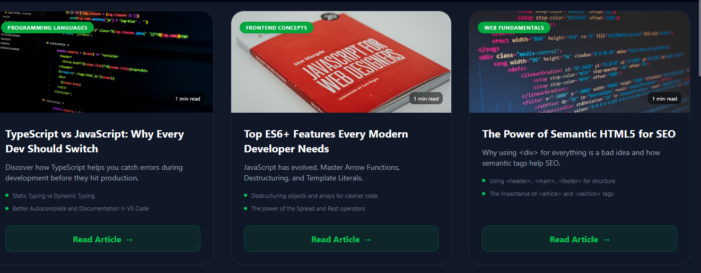

# 🎨 Portfolio Frontend Application

A modern and responsive **Frontend Portfolio Application** built to present projects, growth timeline, blogs, and admin-based UI behavior.

This frontend consumes backend APIs, handles authentication tokens, and dynamically updates the UI based on **user roles (Admin / User)**.

---

## 🛠️ Frontend Tech Stack

<p align="left">
  
  
  
  
  
</p>

---

## 🎯 Purpose of Frontend

- Display portfolio projects and growth timeline
- Handle **Login & Signup UI**
- Store and manage **JWT token on client-side**
- Show / hide UI based on **Admin role**
- Communicate securely with backend APIs

---
## 🔗 Backend Integration

This frontend is connected to a custom backend API built by me.

Backend responsibilities:
- JWT authentication
- Admin & User role validation
- Secure CRUD operations
- Database communication

🔗 Backend Repository:
```bash
https://github.com/qudratullah-stack/FullStack-portfolio-api
```
## 🔐 Authentication (Login & Signup)

The application includes a complete authentication system with proper validation and feedback.

### ✅ Signup Flow
- User can create a new account
- Email validation and duplicate email check
- Password is securely handled
- Success and error messages are clearly displayed

<p align="start">
  
  
</p>

### ✅ Login Flow
- User logs in using registered email and password
- JWT token is generated on successful login
- Token is securely stored on the client side
- User is redirected based on authentication state

<p align="start">
  
</p>

---

### 🛡 Admin Features (Role-Based Access)

This project implements role-based access control where only **Admin users** can manage growth data.

### 🔧 Admin Capabilities
- Create new growth data
- Save and manage skill progress
- Delete existing growth records
- Unauthorized users are restricted from admin actions

<p align="center">
  
  
  
</p>

> ⚠️ Non-admin users cannot perform these actions and receive proper authorization errors.

---

## 🎓 Learning Cards & Navbar Access

This section demonstrates how **Learning Cards** behave differently based on user role.

### 🔹 Admin View
- Admin sees the dashboard link in the navbar.
- Full access to all cards and management actions.

<p align="start">
  
  
</p>

### 🔹 Non-Admin View
- Dashboard link is hidden.
- User can view learning cards but cannot perform admin actions.

<p align="start">
  
</p>

> ✅ Shows clear role-based frontend rendering and user experience.

---

## 🎬 Final Video Showcase

This section presents a **short highlight video** of the project, demonstrating the key features and user interactions in a concise and professional manner.

- Video Duration: ~5–10 seconds
- Shows main frontend features and interactions
- Helps recruiters quickly understand your work

<p align="center">
  <video width="80%" controls autoplay muted>
    <source src="public/Finalchecklist.mp4" type="video/mp4">
    Your browser does not support the video tag.
  </video>
</p>

> ✅ Provides a visual summary of the project in action, enhancing your portfolio's impact.